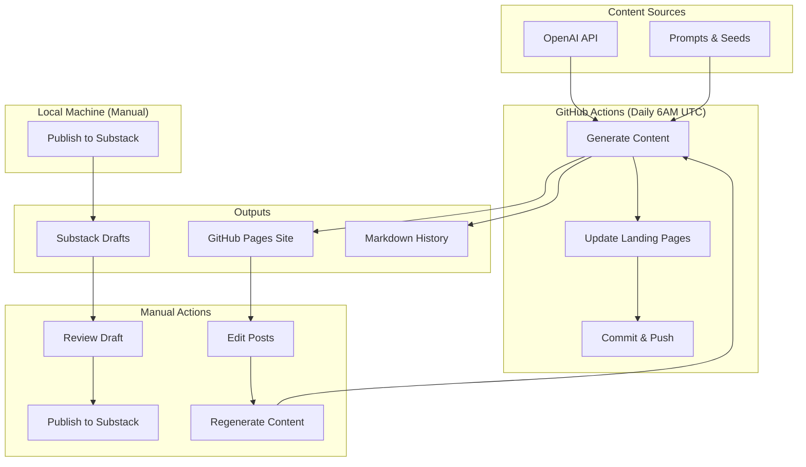
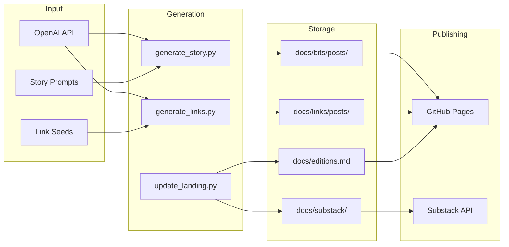
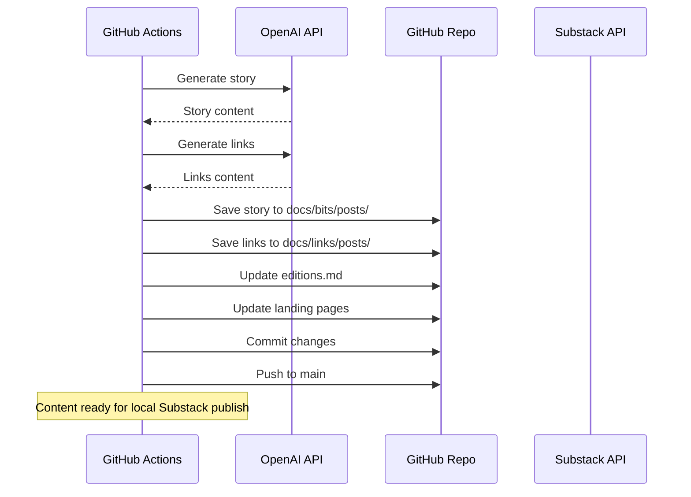
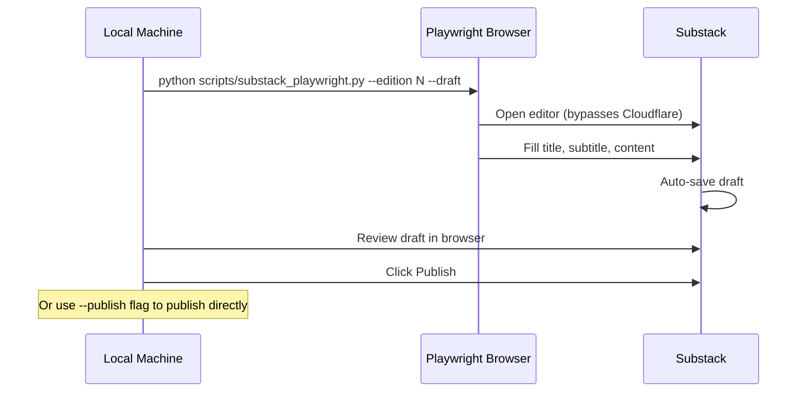
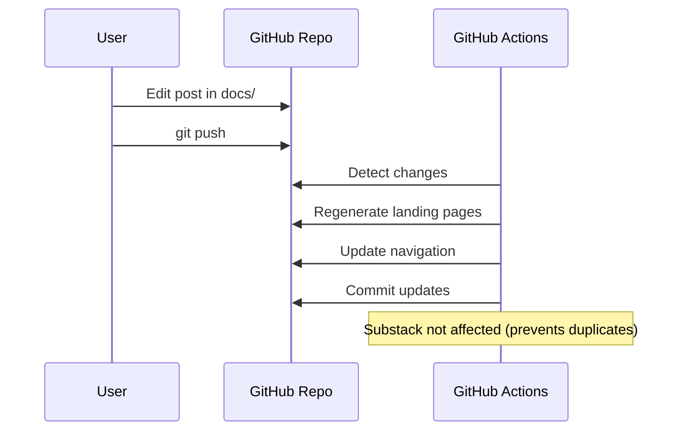
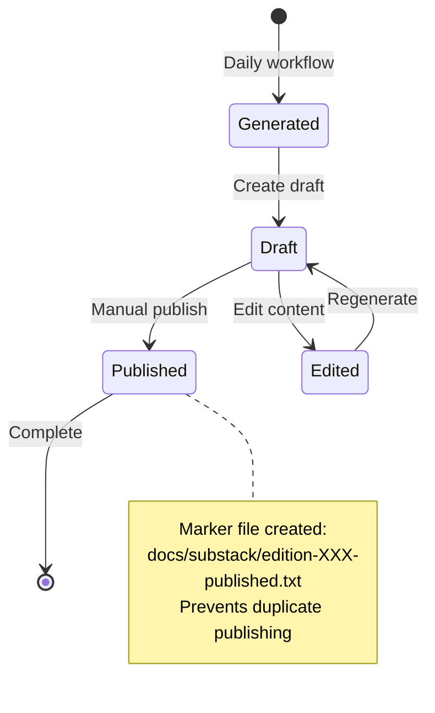

# Obscure Bit System Design

## Overview

Obscure Bit is an automated content generation system that creates and publishes daily tech stories, links, and newsletter editions. The system runs on GitHub Actions for content generation and publishes to GitHub Pages. Substack publishing requires local execution due to Cloudflare restrictions.

## Architecture



## Data Flow



## Action Flows

### 1. Daily Content Generation (Automated)



### 2. Local Substack Publishing (Manual)

**Note:** Substack uses Cloudflare protection that blocks GitHub Actions datacenter IPs. Publishing must be done locally.



#### Local Setup
```bash
# One-time: Install Playwright and login
pip3 install playwright
python3 -m playwright install chromium
python3 scripts/substack_playwright.py --login

# Daily: Publish edition
python3 scripts/substack_playwright.py --edition 3 --draft
```

### 3. Content Update Flow



## File Structure

```
b1ts/
├── .github/workflows/
│   └── generate-content.yml    # Daily automation
├── docs/
│   ├── bits/posts/             # Daily stories
│   ├── links/posts/            # Daily links
│   ├── editions.md             # Edition archive
│   ├── substack/               # Newsletter drafts & history
│   │   ├── YYYY-MM-DD-edition-XXX.md
│   │   └── edition-XXX-published.txt
│   └── stylesheets/
├── scripts/
│   ├── generate_story.py       # AI story generation
│   ├── generate_links.py       # AI links generation
│   ├── update_landing.py       # Site updates
│   └── publish_substack.py     # Substack integration
└── prompts/
    ├── story_seeds.yaml        # Story prompts
    └── links_seeds.yaml        # Link categories
```

## Environment Variables

### GitHub Secrets
```yaml
OPENAI_API_KEY:          # OpenAI API access
OPENAI_API_BASE:         # API endpoint (NVIDIA)
OPENAI_MODEL:            # Model name
# Note: Substack secrets removed - Cloudflare blocks CI
```

### Local Development
```bash
export OPENAI_API_KEY="..."
export OPENAI_API_BASE="https://integrate.api.nvidia.com/v1"
export OPENAI_MODEL="nvidia/llama-3.3-nemotron-super-49b-v1.5"
export SUBSTACK_PUBLICATION_URL="https://obscurebit.substack.com"
export SUBSTACK_COOKIES_PATH="$HOME/.substack_cookies.json"
```

## Publishing States



## Error Handling

### OpenAI API Failures
- Retry mechanism with exponential backoff
- Fallback to cached content if available
- Continue with other content types

### Substack Failures
- Cloudflare blocks GitHub Actions IPs (use local publishing)
- Playwright browser automation bypasses Cloudflare locally
- Browser state saved in ~/.playwright_state.json
- Draft creation is non-destructive
- Duplicate prevention protects against retries

### GitHub Actions Failures
- Workflow continues on partial failures
- Content generation independent from publishing
- Manual recovery possible

## Scaling Considerations

### Content Volume
- Daily editions: ~365 posts/year
- Storage: Minimal (markdown files)
- API calls: 2 per day (story + links)

### Performance
- Generation time: ~30 seconds
- Site rebuild: ~2 minutes
- Substack draft: ~10 seconds

### Cost Management
- OpenAI tokens: ~5K per day
- GitHub Actions: Free tier sufficient
- Substack: Free tier

## Future Enhancements

1. **Scheduled Publishing**: Auto-publish drafts at specific times
2. **Content Caching**: Reduce API calls for unchanged content
3. **Multi-platform**: Add Twitter, LinkedIn integration
4. **Analytics**: Track engagement and optimize content
5. **A/B Testing**: Test different content formats

## Security Considerations

- All secrets stored in GitHub Secrets
- No credentials in code
- Cookie-based auth for Substack
- Read-only file permissions for content

## Monitoring

- GitHub Actions dashboard for workflow status
- Draft review in Substack dashboard
- Site health via GitHub Pages status
- Error notifications via GitHub issues
