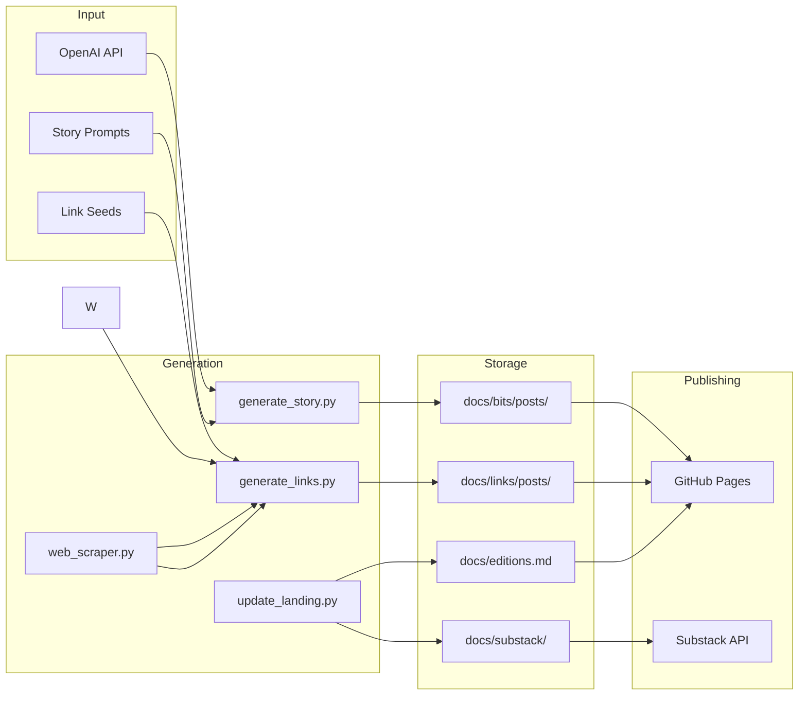
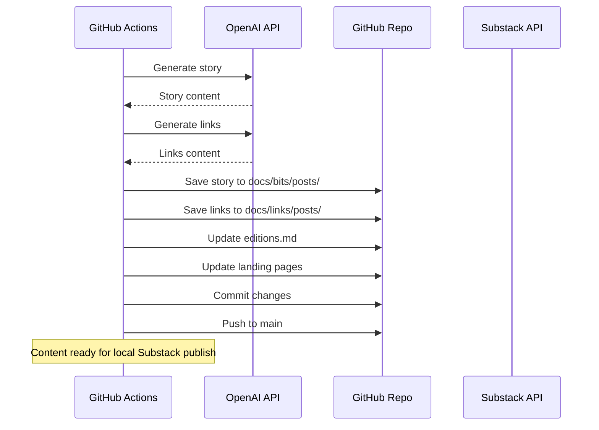
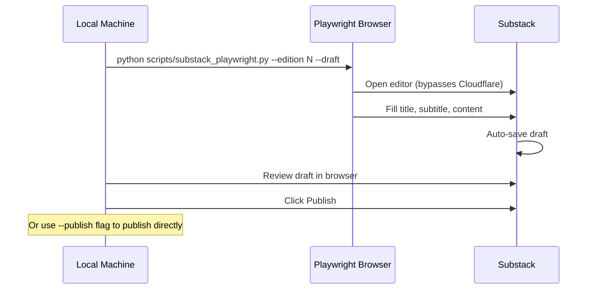
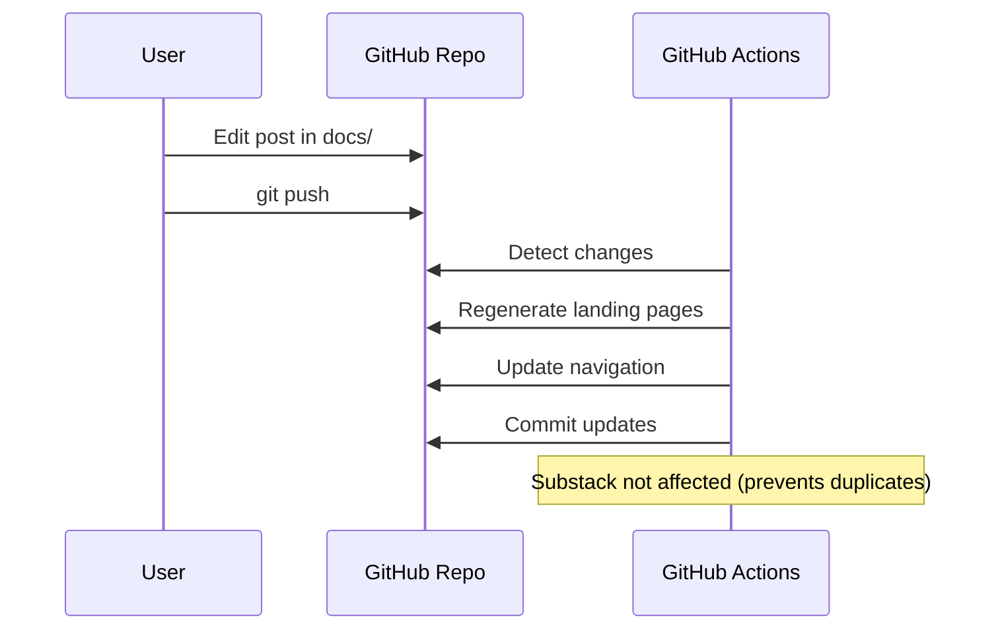
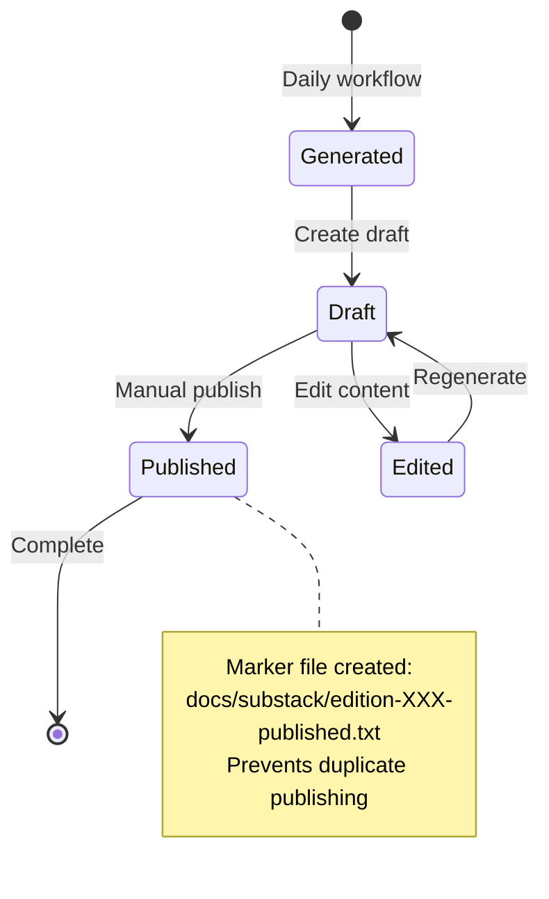

# Obscure Bit System Design

## Overview

Obscure Bit is an automated content generation system that creates and publishes daily tech stories, links, and newsletter editions. A single orchestrator (`run_daily.py`) synchronizes theme selection and triggers the story, link, and landing generators. The system runs on GitHub Actions for content generation and publishes to GitHub Pages. Substack publishing requires local execution due to Cloudflare restrictions.

## Architecture

```mermaid
graph TB
    subgraph "GitHub Actions (Daily 6AM UTC)"
        A[run_daily.py (story+links+landing)] --> B[Update Landing Pages]
        B --> C[Commit & Push]
    end
    
    subgraph "Local Machine (Manual)"
        D[Publish to Substack]
    end
    
    subgraph "Content Sources"
        E[OpenAI API] --> A
        F[Prompts & Seeds] --> A
        W[LLM Strategy + Web Search APIs] --> A
    end
    
    subgraph "Outputs"
        G[GitHub Pages Site]
        H[Substack Drafts]
        I[Markdown History]
    end
    
    A --> G
    A --> I
    D --> H
    
    subgraph "Manual Actions"
        J[Review Draft] --> K[Publish to Substack]
        L[Edit Posts] --> M[Regenerate Content]
    end
    
    H --> J
    G --> L
    M --> A
```

## Data Flow



## Link Generation Architecture (v3 - Research Strategy)

The link generation system uses a multi-stage pipeline with LLM-driven research strategy and active web search:

```mermaid
flowchart LR
    subgraph "Stage 1: LLM Research Strategy"
        RS1[Load research_strategy_system.md]
        RS2[LLM generates domain ideas]
        RS3[LLM generates search queries]
        RS4[Parse structured output]
    end
    
    subgraph "Stage 2: Discovery"
        D1[Execute LLM search queries]
        D2[Extended sources (42 APIs)]
        D3[SerpAPI / ContextualWeb]
        D4[Marginalia fallback]
    end
    
    subgraph "Stage 3: Scraping"
        S1[Fetch Content]
        S2[Extract Concepts]
        S3[Score Obscurity]
    end
    
    subgraph "Stage 4: Verification"
        V1[LLM Relevance Check]
        V2[Keyword Fallback]
    end
    
    subgraph "Stage 5: Selection"
        SEL[Score: 70% relevance + 30% obscurity]
        DIV[Filter Duplicates]
        DOM[Domain Diversity max 3/domain]
        EDU[Filter .edu domains]
    end
    
    RS1 --> RS2
    RS2 --> RS3
    RS3 --> RS4
    RS4 --> D1
    D1 --> S1
    D2 --> S1
    D3 --> S1
    D4 --> S1
    S1 --> S2
    S2 --> S3
    S3 --> V1
    V1 --> SEL
    V2 --> SEL
    SEL --> DIV
    DIV --> DOM
    DOM --> EDU
    EDU --> OUT[Top 7 Links]
```

### Research Strategy System

The new approach asks the LLM to act as a **research strategist** rather than directly suggesting URLs:

1. **Domain Ideas**: LLM suggests 5 creative domain categories (niche history blogs, museum collections, research departments, etc.)
2. **Search Queries**: LLM generates 5 specific, SEO-avoiding queries using technical terms and dates
3. **Query Execution**: System executes queries via DuckDuckGo to discover actual URLs
4. **Direct URLs**: Any URLs the LLM knows with confidence are also included

This approach surfaces obscure content by:
- Avoiding broad keywords that attract clickbait
- Using technical/academic vocabulary
- Searching across diverse domains
- Filtering listicles and SEO-optimized content early

### Resilient Search Stack

To survive DuckDuckGo throttling while still surfacing at least seven high-quality links, the discovery stage fans out across multiple providers:

1. **DuckDuckGo Lite** – still primary for `site:` and operator queries, with request throttling, rotating user agents, and exponential backoff.
2. **SerpAPI (Google)** – triggered automatically when `SERPAPI_KEY` is present; supplies clean organic URLs for broad theme queries.
3. **ContextualWeb Search** – optional RapidAPI fallback for additional coverage.
4. **Marginalia.nu** – indie search engine used whenever DDG exhausts retries or returns HTTP 202/403 throttles.
5. **Curated fallback queries** – `run_fallback_searches()` hits dependable domains (Library of Congress, Smithsonian, Wilson Center, etc.) plus generic "oral history / archives / declassified" searches, ensuring variety even when all other sources are sparse.
6. **Backup booster queries** – if the deduplicated pool has <25 URLs, broad "hidden history" prompts run through both DDG and Marginalia.

Downstream safeguards guarantee at least three published links by temporarily relaxing relevance/obscurity thresholds when the strict pass yields too few candidates.

## Action Flows

### 1. Daily Content Generation (Automated)



### 2. Local Substack Publishing (Manual)

**Note:** Substack uses Cloudflare protection that blocks GitHub Actions datacenter IPs. Publishing must be done locally.



#### Local Setup
```bash
# One-time: Install Playwright and login
pip3 install playwright
python3 -m playwright install chromium
python3 scripts/substack_playwright.py --login

# Daily: Publish edition
python3 scripts/substack_playwright.py --edition 3 --draft
```

### 3. Content Update Flow



## File Structure

```
b1ts/
├── .github/workflows/
│   └── generate-content.yml    # Daily automation
├── docs/
│   ├── bits/posts/             # Daily stories
│   ├── links/posts/            # Daily links
│   ├── editions.md             # Edition archive
│   ├── substack/               # Newsletter drafts & history
│   │   ├── YYYY-MM-DD-edition-XXX.md
│   │   └── edition-XXX-published.txt
│   └── stylesheets/
├── scripts/
│   ├── run_daily.py            # Theme orchestrator (story + links + landing)
│   ├── generate_story.py       # AI story generation
│   ├── generate_links.py       # Enhanced links with LLM research + multi-source search
│   ├── generate_links_old.py   # Legacy links generation (archived)
│   ├── web_scraper.py          # Content extraction & analysis
│   ├── update_landing.py       # Site updates
│   ├── publish_substack.py     # Substack API publishing
│   └── substack_playwright.py  # Cookie extraction helper
├── prompts/
│   ├── story_system.md         # Story generation prompts
│   ├── links_system.md         # Links content generation prompts
│   ├── research_strategy_system.md  # LLM research strategy prompts
│   └── themes.yaml             # Unified themes for stories + links
└── cache/
    └── web_content/            # Cached scraped content
```

## Environment Variables

### GitHub Secrets
```yaml
OPENAI_API_KEY:          # OpenAI API access
OPENAI_API_BASE:         # API endpoint (NVIDIA)
OPENAI_MODEL:            # Model name
SERPAPI_KEY:             # Optional SerpAPI key for resilient search
CONTEXTUALWEB_API_KEY:   # Optional RapidAPI key (ContextualWeb backup)
# Note: Substack secrets removed - Cloudflare blocks CI
```

### Local Development
```bash
export OPENAI_API_KEY="..."
export OPENAI_API_BASE="https://integrate.api.nvidia.com/v1"
export OPENAI_MODEL="nvidia/llama-3.3-nemotron-super-49b-v1.5"
export SERPAPI_KEY="optional-serpapi-key"
export CONTEXTUALWEB_API_KEY="optional-rapidapi-key"
export SUBSTACK_PUBLICATION_URL="https://obscurebit.substack.com"
export SUBSTACK_COOKIES_PATH="$HOME/.substack_cookies.json"
```

## Publishing States



## Error Handling

### OpenAI API Failures
- Retry mechanism with exponential backoff
- Fallback to cached content if available
- Continue with other content types

### Substack Failures
- Cloudflare blocks GitHub Actions IPs (use local publishing)
- Playwright browser automation bypasses Cloudflare locally
- Browser state saved in ~/.playwright_state.json
- Draft creation is non-destructive
- Duplicate prevention protects against retries

### GitHub Actions Failures
- Workflow continues on partial failures
- Content generation independent from publishing
- Manual recovery possible

## Scaling Considerations

### Content Volume
- Daily editions: ~365 posts/year
- Storage: Minimal (markdown files)
- API calls: 2 per day (story + links)

### Performance
- Generation time: ~30 seconds
- Site rebuild: ~2 minutes
- Substack draft: ~10 seconds

### Cost Management
- OpenAI tokens: ~5K per day
- GitHub Actions: Free tier sufficient
- Substack: Free tier

## Future Enhancements

1. **Scheduled Publishing**: Auto-publish drafts at specific times
2. **Content Caching**: Reduce API calls for unchanged content
3. **Multi-platform**: Add Twitter, LinkedIn integration
4. **Analytics**: Track engagement and optimize content
5. **A/B Testing**: Test different content formats

## Security Considerations

- All secrets stored in GitHub Secrets
- No credentials in code
- Cookie-based auth for Substack
- Read-only file permissions for content

## Monitoring

- GitHub Actions dashboard for workflow status
- Draft review in Substack dashboard
- Site health via GitHub Pages status
- Error notifications via GitHub issues
